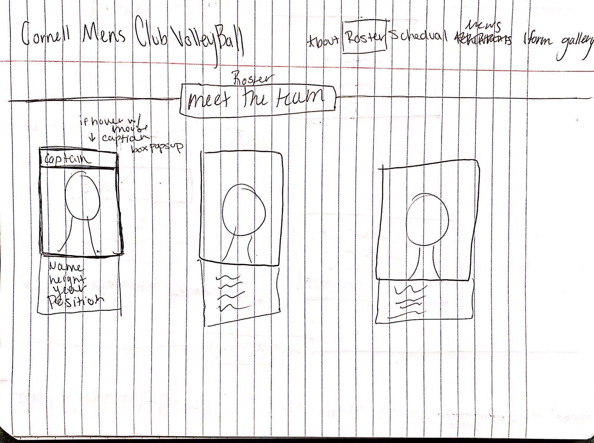

# Project 4 - Design & Plan

Your Team Name: White Cheetah

## Milestone 1: Design your Client's Site

### Client Selection (Milestone 1)

#### Client Description

[Tell us about your client. Who is your client? What kind of website do they want? What are their key goals?]

[NOTE: If you are redesigning an existing website, give us the current URL and some screenshots of the current site. Tell us how you plan to update the site in a significant way that meets the Project 4 requirements.]

Our client is Cornell Men's Club Volleyball. Their goals for the website are to provide information about their team and to attract potential players. They want their website to showcase that they're competitive and have a fun team atmosphere. We're going to significantly change the entire design of the website, merge home and about pages, have a schedule page, a roster page, include a recruit interest form with interactivity and feedback, a photo gallery, and an achievements page.

Current URL:
http://orgsync.rso.cornell.edu/org/mensclubvolleyball/About
  - Form page and Calendar page are inactive.

Screenshots(Only the pages that exist):

Home(About)

Event

News

Pictures

Contact


### Client Needs & Wants/Requirements (Milestone 1)

#### Purpose & Content

[Tell us the purpose of the website and what it is all about.]
The purpose of the website is to primarily provide information to recruits (current Cornell students looking to join or athletes looking to come to Cornell).However, other possible audiences include people who play volleyball at other schools.

#### Client Needs and Wants

[Collect your client's needs and wants for the website. Come up with several appropriate design ideas on how those needs may be met. In the **Memo** field, justify your ideas and add any additional comments you have. There is no specific number of needs required for this, but you need enough to do the job.]


- Needs/Wants #1
  - **Needs and Wants** [What does your client and audience need and want?]
    - Client wants to be notified of potential recruits.
  - **Design Ideas and Choices** [How will you meet those needs and wants?]
    - Have a recruit form as a separate page, so the client can gage interest. Form will send an email to the client with the information.
  - **Memo** [Justify your decisions; additional notes.]
    - Client will be able to keep track prospects in an easy way.
- Needs/Wants #2
  - **Needs and Wants** [What does your client and audience need and want?]
    - Client wants to keep fans/alumni/interested players up to date on team's achievements
  - **Design Ideas and Choices** [How will you meet those needs and wants?]
    - Have a separate achievements tab.
  - **Memo** [Justify your decisions; additional notes.]
      - Users will be able to see how good the team is and what they have been doing.
- Needs/Wants #3
  - **Needs and Wants** [What does your client and audience need and want?]
      - Client wants fans at their games
  - **Design Ideas and Choices** [How will you meet those needs and wants?]
      - Include a schedule tab.
  - **Memo** [Justify your decisions; additional notes.]
      - User's will be able to see when the teams tournaments are and might come watch.
#### Client Meeting Notes

[By this point, you have met once with your client to discuss all their requirements. Include your notes from the meeting, an email they sent you, or whatever you used to keep track of what was discussed at the meeting. Include these artifacts here.]


### Target Audience (Milestone 1)

#### Target Audience(s)

[Tell us about the specific audience(s) for this website.]

The audience for this website is potential recruits for the team. There are two categories of recruits: 1. Young adults who are currently at Cornell who have heard of the team and have interest in it. 2. People who are not currently at cornel but looking to come to the school and want to play volleyball at a lower level than varsity.
The audience also includes teams from other schools who may be sussing out the competition.

#### Target Audience Needs

[What are the needs of your target audience(s)? Note that these are probably *not* the needs of your client.]

Our target audience needs to make the decision wether they want to be part of the team or not. In order to decide this, we need to give the user a holistic, 360 view of the team. They need to know the commitment level, personality, vision, and past looks like of the team.
The other section of the target audience will most likely be looking more at achievements and team information. They will want to see what they team looks like at this current time and who they should look out for. They may also be trying to see how they played against other teams in the past.

### Initial Design (Milestone 1)

#### Content

[Place your content in the **content** folder. NOT in the documents folder.]

What we need from the client:
  - All the info and pictures of the team for the roster
  - Images for Gallery
  - Email to send form to
  - Schedule for this season and next
  - Past achievements

[Note any content (e.g., text, image) that you need to make/get from the client here.]

#### Content Organization, Information Architecture, and Navigation

[Lay out the plan for how you'll organize the site and which content will go where. Plan out the navigation for the site. Document your process for organizing the content.]

[Note: As with the Needs and Wants table, there is no specific amount to write here. You simply need enough content to do the job.]

Example:
- **Navigation**
  - Home
  - Roster
  - Schedule
  - News
  - Interest Form
  - Gallery

- **Content** (List all the content corresponding to main navigation and sub-categories.)
  - *Home*: This page will showcase a photo of the team, a brief intro of the team, The contact info of the president, and lastly notable achievements.;
  - *Roster*: This page will showcase all of the team members. This includes their photo, name, height, year, and position. It will also highlight those who are in leadership positions ;
  - *Schedule*: This page will showcase the tournament and practice schedule for each season.;
  - *News*: This page will showcase highlights of past tournaments as well as results.;
  - *Interest Form*: This page will provide a platform for those interested to contact the team.;
  - *Gallery*: This page will display more images of the team playing;

- **Process**
  - Discussed in detail with client about current navigation and what its flaws are.
  - Looked at other sports teams navigations, picked categories we thought would pertain to the team.
  - Discussed and sketched what pages would look like loosely. Sketched more pages than we planned to include and saw which headers could be combined given similar information (for example we originally had a "achievements" page and we decided to merge with about us and instead add and News page).
  - Card Sort activity 

#### Sketches

[Include exploratory idea sketches of your website.]

[Include sketches of your finalized design.]

- PC Version

Home(About)

Roster

Schedule

News

Form

Gallery


- Mobile Version

Home(About)

Roster

Schedule

News

Form

Gallery

Menu(when menu button is selected)


#### Interactivity

[What interactive features will your site have? Describe how the interactivity connects with the needs of the clients/target audience.]

For our website, we are mainly interacting with our target audiences using an interest form. It meets the needs of the clients because they need to recruit new members from current Cornell students and high school volleyball players who might come to Cornell. It serves our target audiences because they might want to learn more about the club and express interest.

We also intend to create responsive navigation bars and roster. When the user clicks on a button in the navigation bar, it will be highlighted. Also the button whose title corresponding to the current page will remain highlighted when the user is browsing that page to remind them of where they are.

Specifically for the mobile version, the navigation bars will be hidden and replaced by the menu icon, allowing the screen to display more contents of the page. If the user selects the icon, then the menu will appear containing all the navigation tabs.

For our roster, when the user hovers over a photo of a member, the position of that person will be shown. Our client wants to make sure that the target audiences know their positions. With this design we plan to emphasize positions.

#### Additional Comments (Milestone 1)

[If you feel like you haven't fully explained your design choices, or if you want to explain some other functions in your site (such as special design decisions that might not meet the Project 4 requirements), you can use this space to justify your design choices or ask other questions about the project and process.]


## Milestone 2: Draft of Coded Website

### Interactivity (Milestone 2)

[Write your interactivity pseudocode here. Remember you must use two conditional statements.]

*Interest Form pseudocode**

if name is filled out, check to see if it's valid
  if not valid, provide feedback message "Please provide name"

if email is filled out, check to see if it's valid
  if not valid, provide feedback message "Please provide a valid email"

if year is filled out, check to see if it's valid
  if not valid, provide feedback message "Please provide a valid year"

if no checkbox filled out for position
  provide feedback message "Please select a position"

If message is filled out, check to see if it's valid
  if not, provide feedback message "Please write your message here"

Are all the required fields filled out after pressing submit?
  If yes, email form to client

*nav pseuocode*
If tab on nav bar is clicked
  highlight tab

*roster psuedocode*
if mouse is over roster picture
  show positions

Example:
```
if today is a monday:
  show Monday's soup and the daily special

```

*gallery pseudocode*
if cursor hovers over image block
  display a border around the select image
if cursor clicks on the image
  display the image in full size as a popup

*mobile version menu pseudocode*
if user clicks(touches) the menu icon
  if menu bar is not displayed
    display the menu bar from the left
  if menu bar is displayed
    hide the menu bar to the left

### Tasks (Milestone 2)

[You will need to come up with at least 4 tasks. List your tasks here. You *do not* have to do user tests yet.]

Task 1: Look for the team's tournament and practice schedule this semester.

Task 2: Fill out the interest form.

Task 3: How many people are on the team?

Task 4: How did the team do in the most recent season?

### Client Meeting (Milestone 2)

[By this point, you have met once with your client a second time to discuss your initial design. Include your notes from the meeting, an email they sent you, or whatever you used to keep track of what was discussed at the meeting. Write a few sentences about the design feedback you received from your client.]

Detailed meeting minutes can be found in documents/client_meeting_2_minutes.md.

We will
1)change the font,
2)embed a translucent page title onto a team picture instead of current design,
3)style the news page and replace current articles with a more updated version from the client,
4)style the schedule page,
5)make sure our navigation bar buttons don't overlap with each other,
6)keep working on the roster page,
7)not make certain fields in the form required as requested by the client.


### Additional Comments (Milestone 2)

[If you feel like you haven't fully explained your design choices, or if you want to explain some other functions in your site (such as special design decisions that might not meet the Project 4 requirements), you can use this space to justify your design choices or ask other questions about the project and process.]


## Milestone 3: Presentation & Demo Ready Draft

### Additional Comments (Milestone 3)

[If you feel like you haven't fully explained your design choices, or if you want to explain some other functions in your site (such as special design decisions that might not meet the Project 4 requirements), you can use this space to justify your design choices or ask other questions about the project and process.]


## Final Submission: Complete, Polished, and User Tested Website

### Changes Based on Presentation (Final Submission)

[What changes did you make to your plan or design based on your peers' feedback?]

### User Testing (Final Submission)

#### Participant 1

1. Who is your participant, e.g., what is their name, where do they comes from, what is their job, characteristics, etc.?


2. Does your participant belong to your target audience of the site? (Yes / No)

[If “No”, what’s your strategy of associating the user test results to your target audience’s needs and wants? How can your re-design choices based on the user tests make a better fit for the target audience?]

[Report the results for your user's performance on each of your tasks. You should **describe the task** you ask the user to complete, explain **what the user did**, describe the user's **reaction/feedback** to the design, **reflect on the user's performance**, determine what **re-design choices** you will make. You can also add any additional comments in the **memo** field.]

Format:
- Task #1
  - **Task Description** (What was the task for this user?)
    - [You should fill this out]
  - **How did the user do? Did that meet your expectation?**
    - [You should fill this out]
    - [Maybe with multiple points]
  - **User’s reaction / feedback to the design** (e.g., specific problems or issues found in the tasks)
    - [You should fill this out]
  - **Your reflections about the user’s performance to the task**
    - [You should fill this out]
  - **Re-design choices**
    - [You should fill this out]
  - **Memo** (Justify your decisions; additional notes.)
    - [You should fill this out]

[Include evidence of your user testing process.]

#### Participant 2

1. Who is your participant, e.g., what is their name, where do they comes from, what is their job, characteristics, etc.?


2. Does your participant belong to your target audience of the site? (Yes / No)

[If “No”, what’s your strategy of associating the user test results to your target audience’s needs and wants? How can your re-design choices based on the user tests make a better fit for the target audience?]

[Fill this out like you did for Participant 1 above]

#### Participant 3

1. Who is your participant, e.g., what is their name, where do they comes from, what is their job, characteristics, etc.?


2. Does your participant belong to your target audience of the site? (Yes / No)

[If “No”, what’s your strategy of associating the user test results to your target audience’s needs and wants? How can your re-design choices based on the user tests make a better fit for the target audience?]

[Fill this out like you did for Participant 1 above]

### Changes Based on User Testing (Final Submission)

[What changes did you make to your plan or design based on user testing?]

### Final Notes to the Clients (Final Submission)

[Describe in some detail what the client will do (or would have to do) in order to make this website go live. What is the deployment plan?]

[Include any other information that your client needs to know about your final website design. For example, what client wants or needs were unable to be realized in your final product? Why were you unable to meet those wants/needs?]

### Final Notes to the Graders (Final Submission)

[1. Give us three specific strengths of your site that sets it apart from the previous website of the client (if applicable) and/or from other websites. Think of this as your chance to argue for the things you did really well.]

[2. Tell us about things that don't work, what you wanted to implement, or what you would do if you keep working with the client in the future. Give justifications.]

[3. Tell us anything else you need us to know for when we're looking at the project.]
